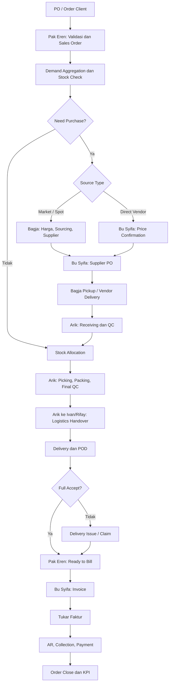
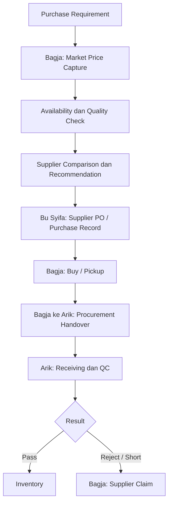
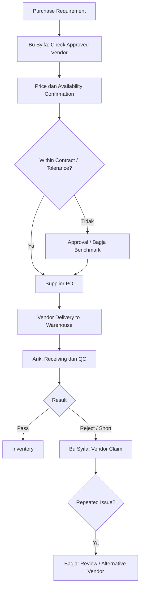
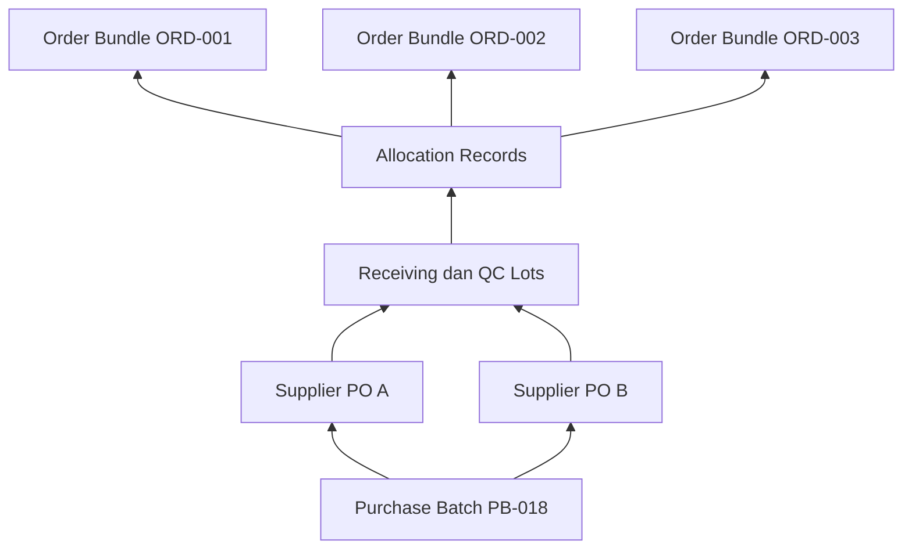
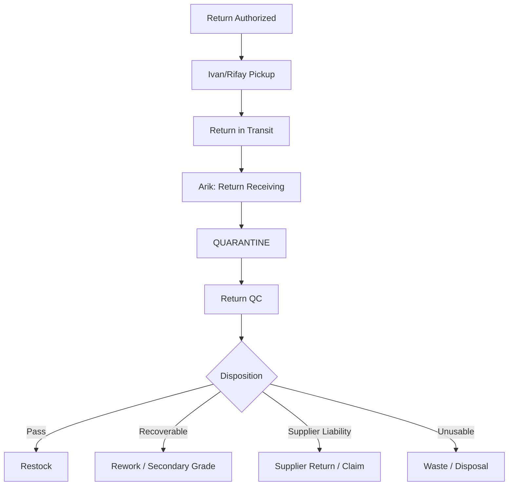
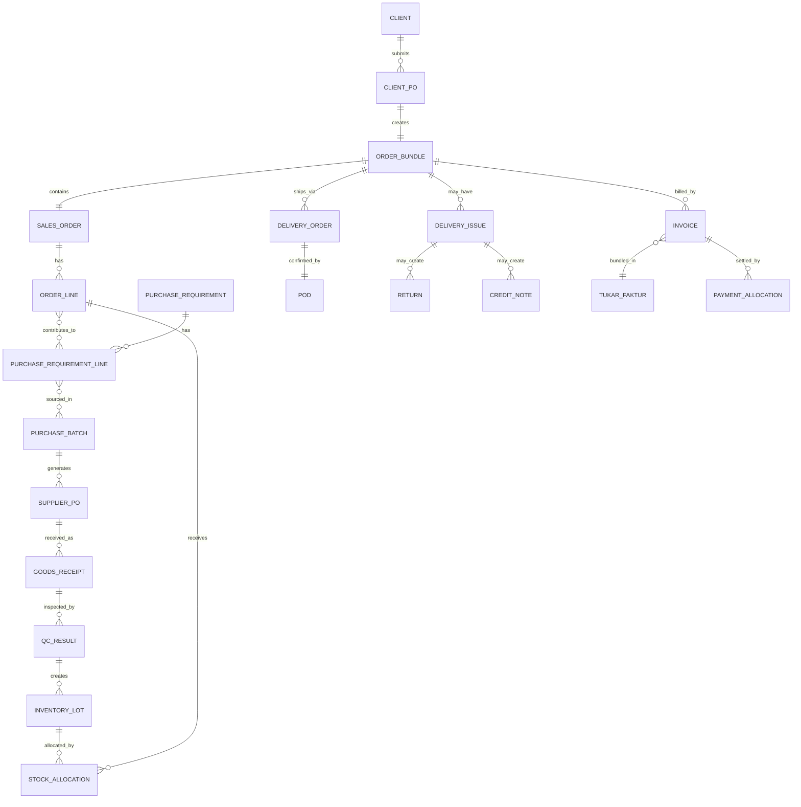

# Playbook Sistem Operasional Supply Chain F&B

**Cakupan:** order client, sourcing, purchasing, receiving, quality control, inventory, warehouse, logistics, delivery issue, billing, tukar faktur, piutang, hutang, kontrol internal, KPI, dan rancangan ERP  
**Versi:** 1.0  
**Tanggal:** 16 Agustus 2026  
**Status:** Draft operasional untuk disahkan manajemen  

---

## Daftar Isi

1. [Tujuan dan ruang lingkup](#1-tujuan-dan-ruang-lingkup)
2. [Model operasi dan prinsip utama](#2-model-operasi-dan-prinsip-utama)
3. [Struktur tim dan ownership](#3-struktur-tim-dan-ownership)
4. [Alur normal end-to-end](#4-alur-normal-end-to-end)
5. [Procurement pasar dan direct vendor](#5-procurement-pasar-dan-direct-vendor)
6. [Receiving, QC, inventory, dan warehouse](#6-receiving-qc-inventory-dan-warehouse)
7. [Handover antar-divisi](#7-handover-antar-divisi)
8. [Order Bundle dan audit trail](#8-order-bundle-dan-audit-trail)
9. [Delivery discrepancy, rejection, dan return](#9-delivery-discrepancy-rejection-dan-return)
10. [Billing, tukar faktur, AR, AP, dan margin](#10-billing-tukar-faktur-ar-ap-dan-margin)
11. [Status operasional](#11-status-operasional)
12. [Dokumen dan data wajib](#12-dokumen-dan-data-wajib)
13. [RACI dan approval matrix](#13-raci-dan-approval-matrix)
14. [SOP per role](#14-sop-per-role)
15. [Spesifikasi sistem ERP](#15-spesifikasi-sistem-erp)
16. [Contoh kasus end-to-end](#16-contoh-kasus-end-to-end)
17. [KPI dan ritme review](#17-kpi-dan-ritme-review)
18. [Prinsip kontrol internal](#18-prinsip-kontrol-internal)
19. [Checklist implementasi](#19-checklist-implementasi)
20. [Lampiran template](#20-lampiran-template)

---

## 1. Tujuan dan ruang lingkup

Playbook ini menjadi acuan kerja tunggal untuk bisnis supply chain F&B yang:

- menerima PO atau order dari client;
- membeli barang dari pasar, petani, distributor, manufacturer, atau vendor rutin;
- mengonsolidasikan barang di gudang;
- melakukan receiving, QC, penyimpanan, alokasi, picking, packing, dan final QC;
- mengirim barang kepada client;
- menangani shortage, rejection, complaint, return, replacement, dan credit;
- menerbitkan invoice, tukar faktur, menagih piutang, dan membayar supplier;
- mengukur HPP, margin, kualitas, ketepatan pengiriman, dan kebocoran operasional.

Tujuan utama:

1. Setiap order punya owner, status, dokumen, dan histori yang jelas.
2. Setiap perpindahan barang punya bukti serah-terima.
3. Setiap keputusan kualitas, stock, dan uang dapat ditelusuri.
4. Masalah dapat dilokalisasi berdasarkan titik proses, bukan asumsi atau chat.
5. Data operasional siap dipakai sebagai fondasi ERP.

### 1.1 Asumsi organisasi saat ini

| Nama | Jabatan operasional dalam playbook |
|---|---|
| Pak Eren | Order & Customer Operations Admin |
| Bu Syifa | Finance & Purchasing Admin |
| Bagja | Sourcing & Procurement Officer |
| Arik | QC & Warehouse Controller |
| Ivan / Rifay | Logistics & Delivery Officer |

Karena tim masih ramping, beberapa fungsi digabung. Kontrol kompensasi diperlukan agar orang yang memilih supplier, menerima barang, mencatat hutang, dan membayar tidak mengendalikan seluruh transaksi sendiri.

### 1.2 Batas keputusan yang belum ditetapkan

Nilai berikut harus disahkan manajemen sebelum playbook diberlakukan penuh:

- batas nominal PO yang memerlukan approval;
- toleransi perubahan harga pasar;
- toleransi shortage dan yield per SKU;
- standar QC per SKU;
- SLA complaint dan replacement;
- batas credit note, refund, discount, dan stock adjustment;
- jadwal cut-off tukar faktur per client;
- target KPI setelah baseline tersedia.

---

## 2. Model operasi dan prinsip utama

### 2.1 Enam aliran yang berjalan bersamaan

| Aliran | Dimulai dari | Berakhir pada |
|---|---|---|
| Demand / order | PO client | Order closed |
| Procurement | Purchase Requirement | Supplier performance review |
| Barang | Supplier / pasar | Client, supplier return, atau waste |
| Inventory | QC pass | Dispatched, returned, atau disposed |
| Dokumen | Client PO / SO | Payment dan archive |
| Uang | Purchase dan invoice | Supplier paid, client paid, margin tercatat |

### 2.2 Prinsip operasi

1. **Sales Order menjadi single source of truth untuk demand client.** Bagja, Arik, dan driver tidak bekerja dari instruksi WhatsApp tanpa referensi order.
2. **Purchase Requirement memakai demand agregat.** Procurement tidak wajib membeli per PO client.
3. **Satu PO client memiliki satu Order Bundle.** Dokumen procurement gabungan dihubungkan melalui allocation record.
4. **Satu Purchase Batch dapat memenuhi banyak Order Bundle.** Hubungan procurement dan client order bersifat many-to-many.
5. **Barang datang belum berarti barang diterima sebagai stock.** Barang harus melalui quantity check dan QC.
6. **Hanya qty QC Pass yang menjadi usable inventory.** Qty reject masuk quarantine, supplier return, rework, atau waste.
7. **Received for QC bukan accepted.** Handover fisik dan keputusan kualitas merupakan dua kejadian berbeda.
8. **Driver mencatat fakta di lapangan; driver tidak memutuskan credit.**
9. **Client rejection belum otomatis menjadi return.** Harus ada registrasi, evidence, validation, dan resolution.
10. **Invoice mengikuti qty komersial yang diterima client.** Koreksi dilakukan dengan adjustment atau credit note, bukan menghapus histori.
11. **Tukar faktur dimiliki Bu Syifa.** Pak Eren memastikan dokumen operasional lengkap.
12. **Setiap perubahan penting menyimpan pelaku, waktu, nilai lama, nilai baru, alasan, dan bukti.**
13. **Tidak ada penghapusan transaksi final.** Gunakan cancel, reversal, adjustment, atau credit note.

### 2.3 Gambaran besar



---

## 3. Struktur tim dan ownership

### 3.1 Ringkasan ownership

| Role | Pertanyaan yang harus mampu dijawab | Ownership utama |
|---|---|---|
| Pak Eren | Client memesan apa, kapan harus dikirim, dan order sekarang ada di mana? | Client PO, SO, status order, dokumen delivery, complaint intake |
| Bu Syifa | Apa yang dibeli, dokumen pembeliannya apa, berapa hutang/piutang, dan kapan dibayar? | Supplier PO, purchasing admin, invoice, tukar faktur, AR, AP, adjustment |
| Bagja | Barang sebaiknya dibeli dari siapa, pada harga berapa, dan bagaimana supply diamankan? | Market sourcing, vendor discovery, benchmark, negosiasi, pickup, supplier claim pasar |
| Arik | Berapa barang yang benar-benar diterima, lolos QC, tersedia, dipilih, dan diserahkan ke driver? | Receiving, QC, stock control, allocation, picking, final QC, return QC |
| Ivan / Rifay | Apa yang dimuat, dikirim, diterima/reject client, dan bukti lapangannya apa? | Loading confirmation, delivery, POD, evidence, return pickup |

### 3.2 Pak Eren — Order & Customer Operations Admin

Owner order client dari order masuk sampai dokumen delivery lengkap.

Tanggung jawab:

- menerima dan mengarsipkan PO/order client;
- memvalidasi client, SKU, spesifikasi, qty, harga jual, alamat, delivery slot, dan payment term;
- membuat Sales Order dan Internal Order ID;
- mengoordinasikan perubahan order sebelum cut-off;
- memonitor status end-to-end;
- memastikan DO, POD, accepted qty, rejection, dan return tercatat;
- menjadi pintu komunikasi complaint client;
- membuat Delivery Issue record;
- menandai order `READY TO BILL` setelah dokumen lengkap;
- mendukung dispute invoice dengan SO, DO, POD, dan issue record;
- bersama Bu Syifa menutup dan mengarsipkan Order Bundle.

Bukan wewenang Pak Eren:

- memutuskan kualitas barang;
- mengubah stock fisik;
- memilih supplier atau menyetujui pembayaran;
- memutuskan nilai credit/refund sendiri.

### 3.3 Bu Syifa — Finance & Purchasing Admin

Memegang transaksi pembelian dan seluruh dampak uang.

Sebagai Purchasing Admin:

- menerima Purchase Requirement;
- meminta atau memperbarui harga vendor rutin;
- menerima rekomendasi supplier/harga dari Bagja;
- membuat Supplier PO atau Purchase Record;
- menjaga vendor master dan payment term;
- mengarsipkan supplier invoice/nota;
- mencocokkan PO, receiving/QC, dan supplier invoice;
- mencatat AP dan menyiapkan pembayaran sesuai approval.

Sebagai Finance:

- membuat invoice client berdasarkan accepted qty dan dokumen final;
- membuat daftar tukar faktur mingguan;
- mencatat tanggal submit dan tanggal diterima client;
- menghitung due date sesuai kontrak client;
- memonitor AR aging dan collection;
- mencatat payment matching, partial payment, dan outstanding;
- membuat credit note, refund, discount, price adjustment, dan supplier debit/claim record berdasarkan approval;
- mengelola AP, pembayaran supplier, dan reconciliation;
- menyajikan margin dan cash exposure.

Bukan wewenang Bu Syifa:

- menentukan actual received qty;
- meloloskan QC;
- mengubah POD;
- memilih vendor baru tanpa sourcing/evaluasi;
- membuat dan menyetujui pembayaran yang sama tanpa approval kedua.

### 3.4 Bagja — Sourcing & Procurement Officer

Memegang sumber supply, terutama pasar/spot dan pengembangan vendor.

Tanggung jawab:

- menangkap harga pasar harian;
- mengecek availability, grade, lokasi, lead time, dan term;
- membandingkan supplier berdasarkan price, quality, reliability, fill rate, return rate, dan lead time;
- merekomendasikan supplier dan alokasi qty;
- menegosiasikan harga/qty;
- mengeksekusi pembelian atau pickup setelah ada Supplier PO/Purchase Record;
- menyerahkan barang dan dokumen belanja kepada Arik;
- menangani supplier claim untuk sumber pasar/spot;
- mencari vendor baru, mengatur sample, dan mendukung approval vendor;
- mengusulkan penggantian supplier bermasalah.

Bukan wewenang Bagja:

- membayar supplier;
- mencatat sendiri barang sebagai stock;
- meluluskan kualitas barang yang dibeli sendiri;
- mengubah Sales Order atau accepted qty client.

### 3.5 Arik — QC & Warehouse Controller

Gatekeeper seluruh barang yang masuk, tersimpan, dialokasikan, dan keluar.

Tanggung jawab:

- menerima handover fisik dari Bagja atau direct vendor;
- mencatat actual received qty dan variance terhadap Supplier PO;
- menjalankan incoming QC;
- menentukan `PASS`, `PARTIAL PASS`, atau `REJECT` berdasarkan standar;
- membuat lot/batch dan stock inbound untuk qty pass;
- memisahkan barang reject/return ke quarantine;
- mengontrol stock masuk, keluar, reserved, rusak, return, rework, dan waste;
- mengalokasikan stock ke order memakai FEFO/FIFO;
- mengontrol picking, weighing, sorting, packing, dan labeling;
- melakukan final QC sebelum `READY TO SHIP`;
- menyerahkan barang ke Ivan/Rifay dengan Logistics Handover;
- memvalidasi complaint quality/qty;
- menjalankan return QC dan root-cause input.

Bukan wewenang Arik:

- mengubah harga beli/jual;
- membuat credit/refund;
- membayar supplier;
- menghapus variance atau waste tanpa bukti dan approval.

### 3.6 Ivan / Rifay — Logistics & Delivery Officer

Memegang chain of custody dari loading sampai POD/return pickup.

Tanggung jawab:

- menerima route, DO, dan Logistics Handover;
- menghitung koli/crate/bag dan mengonfirmasi loading;
- menjaga kondisi barang selama perjalanan;
- mengirim sesuai alamat dan delivery slot;
- mencatat arrival/departure time;
- mendapatkan nama penerima, tanda tangan, foto, timestamp, dan bila tersedia GPS;
- mencatat `FULL ACCEPT`, `PARTIAL ACCEPT`, atau `FULL REJECT` per item;
- mencatat delivered, accepted, dan rejected qty;
- mengumpulkan evidence masalah lapangan;
- membawa return hanya berdasarkan instruksi/otorisasi;
- menyerahkan return kepada Arik melalui Return Handover.

Bukan wewenang Ivan/Rifay:

- menjanjikan credit/refund tanpa approval;
- mengubah qty loading setelah handover tanpa record;
- memasukkan barang return langsung ke stock normal;
- memutuskan claim valid/invalid.

---

## 4. Alur normal end-to-end

### 4.1 Ringkasan alur

```text
CLIENT PO / ORDER
  → SALES ORDER
  → DEMAND AGGREGATION
  → STOCK CHECK
  → PURCHASE REQUIREMENT
  → SOURCE SELECTION
  → SUPPLIER PO / PURCHASE RECORD
  → PROCUREMENT / DELIVERY TO WAREHOUSE
  → RECEIVING
  → INCOMING QC
  → GOODS RECEIPT & INVENTORY
  → STOCK ALLOCATION
  → PICKING / PACKING
  → FINAL QC
  → LOGISTICS HANDOVER
  → DISPATCH
  → POD
  → DELIVERY CONFIRMATION
  → INVOICE
  → TUKAR FAKTUR
  → AR / COLLECTION
  → PAYMENT
  → ORDER CLOSE
```

### 4.2 Detail tahapan

| No. | Tahap | Owner | Aktivitas utama | Output / exit criteria |
|---:|---|---|---|---|
| 1 | Order intake | Pak Eren | Terima PO/order dan dokumen client | Order teregistrasi |
| 2 | Order validation | Pak Eren | Validasi SKU, spec, qty, price, slot, address, term | Order valid atau dikembalikan ke client |
| 3 | Sales Order | Pak Eren | Buat SO dan Internal Order ID | `CONFIRMED` |
| 4 | Demand aggregation | Pak Eren / sistem | Gabungkan demand lintas order per SKU/date | Demand summary |
| 5 | Stock check | Arik / sistem | Bandingkan demand, available stock, reserved stock, buffer | Net purchase need |
| 6 | Purchase Requirement | Sistem/Pak Eren membuat draft demand; Bu Syifa owner review dan release | Buat PR berisi qty dan spec | PR `APPROVED/RELEASED` |
| 7 | Source routing | Bu Syifa | Tentukan market/spot atau direct vendor | Sourcing task |
| 8A | Market sourcing | Bagja | Price capture, availability, negotiation, supplier recommendation | Sourcing Record |
| 8B | Direct price confirmation | Bu Syifa | Hubungi approved vendor dan validasi harga/availability | Quotation / price confirmation |
| 9 | Purchase authorization | Bu Syifa + approver bila perlu | Buat Supplier PO/Purchase Record | PO `RELEASED` |
| 10 | Supply execution | Bagja atau vendor | Pickup pasar atau vendor delivery | Goods in transit |
| 11 | Procurement handover | Bagja/vendor → Arik | Serahkan fisik dan dokumen | `RECEIVED FOR QC` |
| 12 | Receiving | Arik | Timbang/hitung, bandingkan PO vs actual | Goods Receiving record |
| 13 | Incoming QC | Arik | Periksa quality, grade, freshness, temperature, packaging | Pass/partial/reject |
| 14 | Goods receipt | Arik | Buat batch dan stock in hanya qty pass | Available inventory |
| 15 | Supplier variance/claim | Bagja atau Bu Syifa | Tindak shortage/reject supplier | Replace/credit/debit/closed |
| 16 | Stock allocation | Arik / sistem | Reserve lot ke order dengan FEFO/FIFO | Stock `RESERVED` |
| 17 | Picking & packing | Arik | Pick, weigh, sort, process, pack, label | Packed qty |
| 18 | Final QC | Arik | Cocokkan SO, picked, packed, quality | `READY TO SHIP` |
| 19 | Delivery planning | Ivan/Rifay; Pak Eren memberi slot/address | Rute, kendaraan, capacity, sequence | Route/Trip Plan |
| 20 | Logistics handover | Arik → Ivan/Rifay | Count qty dan package; dual confirmation | Driver custody dimulai |
| 21 | Dispatch | Ivan/Rifay | Berangkat dengan DO | `OUT FOR DELIVERY` |
| 22 | Client receiving | Ivan/Rifay + client | Client cek dan konfirmasi item | POD |
| 23 | Delivery completion | Pak Eren | Cek POD, accepted/rejected qty, issue record | `READY TO BILL` atau issue open |
| 24 | Invoice | Bu Syifa | Tagih accepted qty sesuai harga dan tax rule | Invoice posted |
| 25 | Tukar faktur | Bu Syifa | Bundle invoice pada cut-off client | TF submitted/accepted |
| 26 | Collection | Bu Syifa | Aging, reminder, payment matching | Paid/partial/overdue |
| 27 | Close | Pak Eren + Bu Syifa | Fisik, dokumen, finance, issue lengkap | `CLOSED` |

### 4.3 Demand aggregation dan Purchase Requirement

Pembagian ownership PR:

- sistem atau Pak Eren menghasilkan draft dari SO confirmed dan hasil stock check;
- Arik memverifikasi stock basis;
- Bu Syifa bertanggung jawab meninjau, melengkapi, dan me-release PR ke sourcing/purchasing;
- Bagja tidak boleh mengubah demand atau specification tanpa change approval dari order owner.

Contoh:

```text
ORD-001 → Tomat 50 kg
ORD-002 → Tomat 30 kg
ORD-003 → Tomat 20 kg

Total demand       100 kg
Available stock     15 kg
Safety buffer        5 kg
Need purchase       90 kg
```

Formula dasar:

```text
Need Purchase = Confirmed Demand + Safety Buffer - Available Unreserved Stock
```

Purchase Requirement minimal memuat:

- nomor PR;
- required date/time;
- SKU dan spesifikasi;
- total demand;
- stock tersedia;
- buffer;
- need purchase;
- order references;
- destination warehouse;
- source type;
- requester dan approver.

---

## 5. Procurement pasar dan direct vendor

### 5.1 Dua channel procurement

| Dimensi | Market / Spot Procurement | Direct Vendor Procurement |
|---|---|---|
| Contoh | Sayur, cabai, tomat, bawang, kentang | Daging, dairy, frozen, dry goods, packaging, beverage |
| Karakter harga | Berubah cepat, bargain harian | Price list, quotation, contract, atau update rutin |
| Sourcing owner | Bagja | Bu Syifa untuk approved vendor; Bagja untuk vendor baru |
| Supplier selection | Bagja rekomendasikan | Approved Vendor List / contract |
| PO admin | Bu Syifa | Bu Syifa |
| Fulfilment | Bagja pickup / arrange pickup | Vendor kirim ke gudang |
| Receiving & QC | Arik | Arik |
| Claim owner | Bagja | Bu Syifa; eskalasi berulang ke Bagja |

### 5.2 Flow market / spot



Aturan:

- Bagja tidak boleh membeli tanpa PR dan Supplier PO/Purchase Record, kecuali emergency purchase yang disetujui dan dicatat setelahnya dalam SLA yang ditetapkan.
- Harga harian menyimpan supplier, SKU, grade, unit, price, availability, validity, capture time, dan source evidence.
- Supplier tidak dipilih hanya karena termurah. Gunakan total landed/effective cost dan supplier score.
- Pembelian dari beberapa supplier untuk satu SKU diperbolehkan dan harus tercatat per lot.

### 5.3 Flow direct vendor rutin



### 5.4 Vendor baru

```text
Need identified
  → Bagja searches vendors
  → Price, quality, capacity, lead time, term comparison
  → Sample / trial delivery
  → Arik performs QC evaluation
  → Commercial and compliance review
  → Management approval
  → Approved Vendor List
  → Routine transaction handled by Bu Syifa
```

Vendor master minimal memuat:

- legal/trading name dan contact;
- bank account dan owner verification;
- product/SKU/grade coverage;
- price list atau contract;
- lead time, order cut-off, minimum order;
- payment term;
- pickup/delivery arrangement;
- QC standard dan return policy;
- tax documentation bila relevan;
- status approved/suspended/blocked;
- supplier score dan issue history.

### 5.5 Supplier claim ownership

| Sumber barang | Claim owner | Support |
|---|---|---|
| Market / spot sourced oleh Bagja | Bagja | Arik memberi QC evidence; Bu Syifa mencatat dampak uang |
| Direct approved vendor | Bu Syifa | Arik memberi QC evidence |
| Direct vendor berulang kali bermasalah | Bagja | Bu Syifa, Arik, management |

Outcome claim:

- replacement;
- supplier credit/debit note;
- refund;
- discount;
- rejected claim dengan alasan;
- supplier performance penalty;
- suspension atau replacement vendor.

---

## 6. Receiving, QC, inventory, dan warehouse

### 6.1 Receiving

Barang yang tiba memakai status:

```text
ARRIVED → RECEIVED FOR QC → AWAITING QC
```

Arik mencocokkan:

```text
Supplier PO / Purchase Record
vs
Physical Received
vs
Supplier Delivery Note / Nota
```

Contoh:

```text
Ordered          100 kg
Physical received 98 kg
Quantity variance -2 kg
```

Quantity shortage dan quality loss harus dipisah:

```text
PO qty           100 kg
Received qty      98 kg  → shortage 2 kg
QC pass qty       94 kg
QC reject qty      4 kg  → quality loss 4 kg
```

### 6.2 Incoming QC

Parameter disesuaikan per SKU:

- berat/jumlah;
- grade;
- ukuran;
- freshness/ripeness;
- warna, aroma, tekstur;
- kerusakan/defect percentage;
- packaging integrity;
- temperature;
- manufacturing/expiry date;
- lot/batch;
- client-specific specification.

Keputusan:

| Keputusan | Dampak |
|---|---|
| Pass | Seluruh qty diterima ke inventory |
| Partial Pass | Qty pass masuk inventory; qty reject ke quarantine/claim |
| Reject | Tidak masuk inventory normal; claim/return/replacement |

Override QC hanya boleh dilakukan approver yang ditetapkan, dengan alasan, risiko, dan bukti. Arik tidak boleh mengubah hasil final tanpa histori.

### 6.3 Goods receipt dan lot tracking

Goods Receipt dibuat setelah QC. Setiap lot minimal menyimpan:

- lot/batch ID;
- SKU dan grade;
- supplier;
- Supplier PO/Purchase Batch;
- received date/time;
- QC result;
- qty pass;
- unit cost;
- expiry/best-before bila ada;
- storage location;
- photo/certificate bila diperlukan.

### 6.4 HPP efektif

Untuk barang dengan loss saat receiving/QC:

```text
Effective Unit Cost = Total Cost Attributable / Usable QC-Pass Qty
```

Contoh:

```text
Total purchase cost  Rp1.600.000
Usable QC-pass qty   123 kg
Effective HPP         Rp13.008/kg
```

Total cost attributable dapat mencakup purchase price, pickup, transport, market fee, dan direct handling cost sesuai kebijakan accounting.

### 6.5 Inventory states

```text
AWAITING QC
  → AVAILABLE
  → RESERVED
  → PICKED
  → PACKED
  → STAGED
  → DISPATCHED

Exception:
QUARANTINE
  → RESTOCK
  → REWORK
  → SUPPLIER RETURN
  → WASTE
```

### 6.6 FEFO / FIFO

- Gunakan **FEFO** untuk SKU dengan expiry/best-before.
- Gunakan **FIFO** jika expiry tidak tersedia.
- Allocation override wajib menyimpan alasan, pelaku, lot asal, dan approver.

### 6.7 Stock allocation

Stock yang sudah dijanjikan berubah dari `AVAILABLE` menjadi `RESERVED` dan tidak boleh dipakai order lain tanpa deallocation record.

Contoh:

```text
Available stock  163 kg
ORD-A reserve     50 kg
ORD-B reserve     80 kg
ORD-C reserve     30 kg
Free stock         3 kg
```

### 6.8 Picking, processing, packing, dan labeling

```text
Pick List
  → Picking
  → Weighing
  → Sorting / Processing
  → Packing
  → Labeling
  → Final QC
```

Label minimal:

- client;
- order ID;
- SKU/grade;
- net qty;
- lot/batch;
- delivery date;
- storage instruction bila relevan.

### 6.9 Final QC dan release

Arik membandingkan:

```text
Sales Order vs Allocation vs Picked Qty vs Packed Qty vs Physical Qty
```

Release criteria:

- SKU benar;
- grade/spec benar;
- qty benar atau approved short;
- packaging benar;
- label benar;
- quality pass;
- DO tersedia;
- issue pra-pengiriman sudah diselesaikan.

Order tidak menjadi `READY TO SHIP` bila discrepancy belum diselesaikan.

---

## 7. Handover antar-divisi

### 7.1 Prinsip chain of custody

Setiap handover mencatat:

- nomor handover;
- referensi order/PO/batch;
- pihak menyerahkan dan menerima;
- tanggal dan waktu;
- lokasi;
- SKU, lot, qty, unit;
- jumlah package/koli;
- kondisi;
- evidence/photo;
- catatan discrepancy;
- dual confirmation.

Handover tidak harus berupa kertas. Digital confirmation dengan timestamp lebih baik, selama audit log tidak dapat diubah tanpa jejak.

### 7.2 Pak Eren → Purchasing / Sourcing

Dokumen: **Purchase Requirement**.

Exit criteria:

- SO confirmed;
- demand aggregated;
- stock check selesai;
- need purchase dan required time jelas;
- specification lengkap;
- order references tercantum.

### 7.3 Bagja → Arik

Dokumen: **Procurement Handover / Incoming Goods Manifest**.

```text
Bagja confirms: Delivered to warehouse
Arik confirms: Received for QC
```

`Received for QC` hanya memindahkan custody. Keputusan accept stock baru terjadi setelah receiving dan QC.

### 7.4 Direct vendor → Arik

Dokumen: Supplier Delivery Note + Supplier PO reference + Goods Arrival record.

Arik tidak boleh menerima direct vendor hanya berdasarkan pengakuan vendor. Supplier PO/Purchase Record harus tersedia atau exception approval dicatat.

### 7.5 Arik → Ivan/Rifay

Dokumen: **Logistics Handover**.

Dual check:

- order dan client;
- item dan qty;
- package/koli count;
- final QC;
- packaging/label;
- DO;
- handling/temperature instruction;
- departure seal bila digunakan.

Custody logistics dimulai saat driver mengonfirmasi loaded qty/package.

### 7.6 Ivan/Rifay → Client

Dokumen: **POD**.

POD harus mampu mencatat per item:

- ordered qty;
- delivered qty;
- accepted qty;
- rejected qty;
- reason code;
- client note;
- client receiver;
- timestamp;
- driver;
- signature/photo/GPS bila tersedia.

### 7.7 Ivan/Rifay → Arik untuk return

Dokumen: **Return Handover**.

Barang return masuk `QUARANTINE`, bukan `AVAILABLE`. Arik melakukan count dan Return QC sebelum disposition.

---

## 8. Order Bundle dan audit trail

### 8.1 Konsep

**Satu PO client = satu Order Bundle / Order Dossier.**

Contoh:

```text
Client PO        PO-CLIENT-0158
Internal Order   ORD-0158
Client           Hotel ABC
Delivery Date    17 Aug 2026
```

Semua dokumen order memakai `ORD-0158` sebagai referensi. Procurement gabungan tidak dipaksa 1:1 dengan PO client.

### 8.2 Purchase Batch dan allocation link



Contoh:

```text
Purchase Batch PB-018
Tomat QC-pass 100 kg

Allocated:
ORD-001  50 kg
ORD-002  30 kg
ORD-003  20 kg
```

### 8.3 Isi Order Bundle

| Tahap | Dokumen / record | Owner |
|---:|---|---|
| 1 | Client PO / order evidence | Pak Eren |
| 2 | Sales Order | Pak Eren |
| 3 | Change log / approval | Pak Eren |
| 4 | Purchase Requirement | Sistem/Pak Eren draft; Bu Syifa review/release owner |
| 5 | Purchase Batch allocation reference | Sistem / Bu Syifa |
| 6 | Sourcing Record / quotation | Bagja atau Bu Syifa |
| 7 | Supplier PO / Purchase Record | Bu Syifa |
| 8 | Procurement Handover / vendor delivery note | Bagja/vendor → Arik |
| 9 | Goods Receiving | Arik |
| 10 | Incoming QC Report | Arik |
| 11 | Lot and stock allocation | Arik / sistem |
| 12 | Pick List | Arik / sistem |
| 13 | Packing and Final QC | Arik |
| 14 | Logistics Handover | Arik → Ivan/Rifay |
| 15 | Delivery Order / Surat Jalan | Pak Eren / sistem |
| 16 | POD | Ivan/Rifay + client |
| 17 | Delivery Issue / Return documents bila ada | Pak Eren + role terkait |
| 18 | Invoice / adjustment | Bu Syifa |
| 19 | Tukar Faktur link | Bu Syifa |
| 20 | Payment matching | Bu Syifa |
| 21 | Order Close checklist | Pak Eren + Bu Syifa |

### 8.4 Timeline audit

Contoh:

```text
03:12  Pak Eren created SO-0158
03:18  PR-014 created
03:24  Bagja accepted sourcing task
04:10  PO-SUP-042 procurement completed
04:17  Arik received PH-008 for QC
04:31  QC-008 completed
05:42  Picking completed
06:12  Ivan accepted LH-019
06:18  Vehicle departed
07:43  Client receiving started
07:45  POD signed: full accept
09:20  Pak Eren marked ready to bill
14:13  Bu Syifa posted INV-0158
```

### 8.5 Root-cause localization

| Perbandingan | Indikasi titik masalah |
|---|---|
| Client PO 100 kg; SO 80 kg | Order entry / Pak Eren |
| SO Grade A; PR Grade A; Supplier PO Grade B | Purchasing/procurement selection |
| Supplier PO 100 kg; physical receiving 96 kg | Supplier/procurement shortage |
| Received 100 kg; QC pass 95 kg | Incoming quality loss |
| QC pass 100 kg; final packed 90 kg | Warehouse/picking/packing |
| Arik handover 100 kg; driver accepts 100 kg; client gets 90 kg | Logistics/delivery |
| POD accepted 100 kg; invoice 110 kg | Billing / Bu Syifa |

Order Bundle berfungsi sebagai chain of responsibility, bukan hanya arsip.

---

## 9. Delivery discrepancy, rejection, dan return

### 9.1 Prinsip exception flow

```text
Client complaint/rejection
  → Register Delivery Issue
  → Capture evidence
  → Triage category and owner
  → Validate claim
  → Decide resolution
  → Execute physical action
  → Execute financial adjustment
  → Determine root cause
  → Client confirmation
  → Close case
```

Complaint tidak boleh diselesaikan hanya lewat chat atau edit invoice manual.

### 9.2 Jenis discrepancy

| Jenis | Contoh | Default investigation owner | Kemungkinan resolusi |
|---|---|---|---|
| Quantity shortage | Order 50 kg, diterima 47 kg | Arik + Ivan/Rifay | Deliver shortage, invoice accepted qty, credit |
| Over delivery | Order 50 kg, terkirim 55 kg | Arik + Ivan/Rifay | Client accept & invoice, atau pickup 5 kg |
| Wrong item | Order cabai merah, kirim cabai hijau | Arik | Replacement, return, credit |
| Poor quality | Busuk, terlalu matang, grade rendah | Arik | Validate, replacement, discount, credit, return |
| Wrong specification | Ukuran/grade/processing tidak sesuai | Pak Eren + Bagja + Arik | Investigasi source of spec error |
| Packaging damage | Bocor, sobek, crate rusak | Arik / Logistics | Replace, rework, credit |
| Temperature issue | Cold-chain breach | Ivan/Rifay + Arik | Quarantine, reject, supplier/logistics claim |
| Late delivery | Lewat delivery slot | Ivan/Rifay | Client communication, service recovery |
| Document discrepancy | DO/POD/price/PO mismatch | Pak Eren / Bu Syifa | Correct document with audit trail |

### 9.3 Registration

Pak Eren membuat Delivery Issue:

```text
Issue ID       DI-260816-0042
Client         Restaurant ABC
Order          ORD-0158
DO / POD       DO-0158 / POD-0158
Issue type     QUALITY
SKU / lot      TOMAT-A / TMT-260817-01
Claimed qty    12 kg
Reported at    17 Aug 2026 07:45
Reported by    Client Receiver / Ivan
Evidence       Photo + POD note
```

### 9.4 Driver confirmation

Jika masalah ditemukan saat delivery, Ivan/Rifay mencatat:

```text
Delivered  50 kg
Accepted   38 kg
Rejected   12 kg
Reason     Too ripe
```

Client menandatangani hasil aktual. POD tidak cukup hanya menampilkan `DELIVERED`.

### 9.5 Evidence

Evidence sesuai kasus:

- photo/video;
- qty/weight;
- lot number;
- timestamp dan delivery time;
- receiving temperature;
- client receiver statement;
- driver statement;
- Final QC record;
- loading handover;
- packaging/seal condition.

Claim tanpa evidence menjadi `PENDING VERIFICATION`, bukan otomatis ditolak atau disetujui.

### 9.6 Validation

Arik/Ops menentukan:

- `VALID`;
- `PARTIALLY VALID`;
- `INVALID`.

Contoh:

```text
Client claim       15 kg damaged
Validated damaged  10 kg
Usable              5 kg
Approved claim     10 kg
```

Pak Eren menyampaikan hasil kepada client. Arik memutuskan aspek quality/qty. Bu Syifa menjalankan dampak uang.

### 9.7 Resolution

#### A. Replacement

```text
Approved rejected qty
  → Replacement Order
  → Stock allocation
  → Pick / pack / final QC
  → Replacement delivery
  → Replacement POD
```

Replacement memakai nomor `RO-...`, terkait ke issue dan original order, serta tidak menghasilkan revenue baru kecuali ada commercial agreement lain.

#### B. Credit note

Dipakai bila invoice sudah diterbitkan dan nilai tagihan harus dikurangi.

```text
Original invoice  Rp1.000.000
Credit note         Rp150.000
Outstanding         Rp850.000
```

#### C. Refund / customer credit balance

Dipakai bila client sudah membayar. Refund harus memiliki approval dan payment reference. Alternatif: customer credit balance untuk order berikutnya.

#### D. Discount / price adjustment

Dipakai bila client menerima barang dengan grade/kondisi berbeda pada harga yang disepakati.

#### E. Rejected claim

Alasan, evidence, approver, dan komunikasi client wajib tercatat.

### 9.8 Return flow



Barang return tidak langsung masuk inventory normal.

### 9.9 Tiga jenis return

| Jenis | Gerakan fisik | Dampak accounting/inventory |
|---|---|---|
| Customer Return | Client → perusahaan | Quarantine; credit/replacement/discount |
| Supplier Return | Perusahaan → supplier | Reduce/adjust inventory/AP; supplier claim |
| Internal Waste | Gudang → disposal | Inventory write-off; loss reason dan approval |

### 9.10 Root-cause categories

| Sumber | Contoh root cause |
|---|---|
| Client/order entry | Wrong specification entered |
| Procurement | Wrong grade/source purchased |
| Supplier | Poor incoming quality / shortage |
| QC | Defect missed |
| Warehouse | Wrong picking / weighing |
| Packing | Insufficient packaging / wrong label |
| Logistics | Loss, delay, handling, temperature failure |
| Billing | Wrong accepted qty / price used |

### 9.11 Status Delivery Issue

```text
OPEN
  → PENDING EVIDENCE
  → INVESTIGATING
  → VALID / PARTIALLY VALID / INVALID
  → RESOLUTION APPROVED
  → RESOLUTION IN PROGRESS
  → FINANCIAL ADJUSTMENT
  → CLIENT CONFIRMED
  → CLOSED
```

Case boleh ditutup hanya jika:

- masalah fisik selesai;
- dampak inventory selesai;
- dampak financial selesai;
- client menerima resolution;
- root cause dan responsible source tercatat;
- action pencegahan dibuat untuk kasus material/berulang.

---

## 10. Billing, tukar faktur, AR, AP, dan margin

### 10.1 Handover operasional ke billing

```text
Delivery / POD
  → Pak Eren checks document completeness
  → Accepted qty and open issue confirmed
  → READY TO BILL
  → Bu Syifa generates invoice
```

Invoice tidak dibuat dari ordered qty bila POD menunjukkan short delivery atau rejection yang diterima secara komersial.

### 10.2 Invoice

Invoice minimal terkait dengan:

- client;
- Order Bundle;
- Client PO;
- SO;
- DO/POD;
- accepted qty;
- selling price;
- adjustment/credit/replacement reference;
- invoice date;
- tax document bila relevan;
- payment term;
- billing period.

### 10.3 Tukar faktur

**Owner: Bu Syifa.**

Pak Eren menyediakan dan memeriksa dokumen operasional; Arik membantu dispute qty; Ivan/Rifay melengkapi POD.

Flow:

```text
Invoice harian
  → Cut-off mingguan per client
  → Bu Syifa membuat daftar tukar faktur
  → Lampiran diverifikasi
  → Submit / upload ke client
  → Client receipt confirmation
  → Tukar Faktur Received Date
  → Due date calculation
  → AR / collection
```

Contoh:

```text
TUKAR FAKTUR TF-2026-08-003
Client: Hotel A
Periode: 10–16 Agustus 2026

INV-001  Rp2.000.000
INV-002  Rp1.500.000
INV-003  Rp3.000.000
INV-004  Rp2.500.000
---------------------
TOTAL    Rp9.000.000
```

Lampiran sesuai requirement client:

- invoice;
- Client PO;
- DO/surat jalan;
- POD;
- faktur pajak bila relevan;
- credit note/adjustment;
- dokumen khusus client.

### 10.4 Due date

Basis due date harus mengikuti kontrak/client rule. Bisa dihitung dari:

- invoice date;
- delivery date;
- tukar faktur submitted date;
- tukar faktur received/accepted date.

Field wajib:

```text
Invoice Date
Billing Period
Tukar Faktur Date
Tukar Faktur Received Date
Payment Term Basis
Payment Term Days
Due Date
```

Contoh:

```text
TF received      17 Aug 2026
Term             30 days after TF receipt
Due date         16 Sep 2026
```

### 10.5 AR dan collection

AR aging buckets:

```text
Current
1–14 days overdue
15–30 days
31–60 days
61–90 days
90+ days
```

Payment matching menyimpan invoice allocation. Partial payment tidak menutup invoice:

```text
Invoice       Rp15.000.000
Payment       Rp10.000.000
Outstanding    Rp5.000.000
```

### 10.6 Dispute invoice

```text
Invoice DISPUTED
  → Pak Eren checks Client PO, SO, DO, POD
  → Arik checks qty/quality if needed
  → Bu Syifa issues correction/credit note
  → Client accepts correction
  → Invoice returns to collection flow
```

### 10.7 AP supplier

```text
Supplier PO
  → Goods Receiving
  → QC accepted qty
  → Supplier Invoice / Nota
  → 3-way match
  → AP approved
  → Payment
  → Reconciliation
```

Untuk spot purchase yang tidak memiliki invoice formal, nota/bukti pembelian dan procurement handover menjadi dokumen pengganti sesuai kebijakan accounting dan pajak.

Supplier payment basis sebaiknya mengikuti accepted qty, setelah shortage/reject/claim diperhitungkan.

### 10.8 Margin

```text
Revenue
- Effective COGS
= Gross Profit

Gross Profit
- Transportation
- Packaging
- Warehouse handling
- Waste
- Payment fee
- Direct labor allocation
= Contribution Margin
```

Margin harus tersedia per:

- order;
- client;
- SKU;
- supplier/source;
- delivery route;
- periode.

---

## 11. Status operasional

### 11.1 Sales Order / Order Bundle

```text
DRAFT
  → RECEIVED
  → VALIDATING
  → CONFIRMED
  → PROCUREMENT IN PROGRESS
  → GOODS AVAILABLE
  → ALLOCATED
  → PICKING
  → PACKED
  → READY TO SHIP
  → OUT FOR DELIVERY
  → DELIVERED
  → READY TO BILL
  → BILLED
  → PAID
  → CLOSED
```

Exception states:

- `ON HOLD`;
- `PARTIALLY FULFILLED`;
- `DELIVERY ISSUE OPEN`;
- `CANCELLED`;
- `CLOSED WITH ADJUSTMENT`.

### 11.2 Purchase Requirement

```text
DRAFT → REVIEW → RELEASED → SOURCING → PO CREATED → FULFILLED → CLOSED
```

Exception: `PARTIALLY FULFILLED`, `ON HOLD`, `CANCELLED`.

### 11.3 Supplier PO

```text
DRAFT → APPROVED → RELEASED → ACKNOWLEDGED → IN TRANSIT
→ PARTIALLY RECEIVED / RECEIVED → QC SETTLED → AP MATCHED → CLOSED
```

### 11.4 Receiving dan QC

```text
ARRIVED → RECEIVED FOR QC → AWAITING QC
→ PASS / PARTIAL PASS / REJECT → GR POSTED / CLAIM OPEN → CLOSED
```

### 11.5 Inventory

```text
AWAITING QC → AVAILABLE → RESERVED → PICKED → PACKED → STAGED → DISPATCHED
```

Exception: `QUARANTINE`, `REWORK`, `SUPPLIER RETURN`, `WASTE`, `ADJUSTMENT PENDING`.

### 11.6 Delivery

```text
PLANNED → LOADING → LOADED → DISPATCHED → ARRIVED
→ FULL ACCEPT / PARTIAL ACCEPT / FULL REJECT → POD COMPLETE → CLOSED
```

### 11.7 Invoice dan tukar faktur

```text
DRAFT
  → WAITING DOCUMENT
  → READY TO BILL
  → POSTED
  → INCLUDED IN TUKAR FAKTUR
  → TUKAR FAKTUR SUBMITTED
  → ACCEPTED BY CLIENT
  → WAITING PAYMENT
  → PARTIALLY PAID / PAID
```

Exception: `DISPUTED`, `CORRECTION REQUIRED`, `CREDITED`, `VOID BY REVERSAL`, `OVERDUE`.

### 11.8 AP

```text
INVOICE RECEIVED → MATCHING → DISPUTED / APPROVED
→ SCHEDULED → PARTIALLY PAID / PAID → RECONCILED
```

---

## 12. Dokumen dan data wajib

### 12.1 Nomor dokumen yang disarankan

| Dokumen | Prefix contoh |
|---|---|
| Internal Order | `ORD-YYMMDD-NNN` |
| Sales Order | `SO-YYMMDD-NNN` |
| Purchase Requirement | `PR-YYMMDD-NNN` |
| Purchase Batch | `PB-YYMMDD-NNN` |
| Supplier PO | `PO-SUP-YYMMDD-NNN` |
| Procurement Handover | `PH-YYMMDD-NNN` |
| Goods Receiving | `GR-YYMMDD-NNN` |
| QC Report | `QC-YYMMDD-NNN` |
| Stock Allocation | `ALLOC-YYMMDD-NNN` |
| Pick List | `PL-YYMMDD-NNN` |
| Logistics Handover | `LH-YYMMDD-NNN` |
| Delivery Order | `DO-YYMMDD-NNN` |
| Proof of Delivery | `POD-YYMMDD-NNN` |
| Delivery Issue | `DI-YYMMDD-NNN` |
| Replacement Order | `RO-YYMMDD-NNN` |
| Customer Return | `CR-YYMMDD-NNN` |
| Supplier Claim | `SC-YYMMDD-NNN` |
| Waste Record | `WR-YYMMDD-NNN` |
| Invoice | `INV-YYMMDD-NNN` |
| Credit Note | `CN-YYMMDD-NNN` |
| Tukar Faktur | `TF-YYYY-WW-NNN` |

Nomor harus unik dan tidak digunakan ulang setelah cancellation.

### 12.2 Dokumen minimum per proses

| Proses | Dokumen wajib | Bukti tambahan |
|---|---|---|
| Client order | Client PO/order evidence, SO | Price agreement, client spec |
| Procurement need | PR, stock snapshot | Demand aggregation |
| Market purchase | Price capture, sourcing record, PO/purchase record | Chat quotation, nota, photo |
| Direct vendor | Quotation/contract, Supplier PO | Vendor acknowledgement |
| Goods arrival | Handover/delivery note, GR | Photo, weigh slip |
| QC | QC report | Photo, temperature, sample result |
| Inventory | Lot/GR, stock movement | Location scan |
| Fulfilment | Allocation, Pick List, packing/final QC | Label/photo |
| Dispatch | DO, Logistics Handover | Route, vehicle, seal |
| Delivery | POD | Signature, photo, GPS |
| Issue/return | DI, evidence, validation, return QC | Client communication |
| Billing | Invoice, POD, Client PO | Tax docs, credit note |
| Tukar faktur | TF list dan submission receipt | Required client attachments |
| Payment | Bank/payment proof, matching | Withholding/tax evidence |
| Close | Order Close checklist | Root-cause/CAPA if issue |

### 12.3 Mandatory fields lintas dokumen

Setiap record transaksi menyimpan:

- unique ID;
- source document reference;
- owner;
- status;
- created by/at;
- last modified by/at;
- effective date/time;
- warehouse/location;
- SKU, grade/spec, qty, unit;
- monetary fields bila relevan;
- attachment/evidence;
- approval history;
- cancellation/adjustment reason.

---

## 13. RACI dan approval matrix

Keterangan:

- **R — Responsible:** pelaksana.
- **A — Accountable:** pemilik hasil/keputusan akhir.
- **C — Consulted:** dimintai masukan.
- **I — Informed:** diberi informasi.
- **Mgt:** management/approver yang ditunjuk.

### 13.1 RACI normal flow

| Aktivitas | Eren | Syifa | Bagja | Arik | Ivan/Rifay | Mgt |
|---|:---:|:---:|:---:|:---:|:---:|:---:|
| Terima dan validasi PO client | A/R | C | I | I | I | I |
| Buat Sales Order | A/R | I | I | I | I | I |
| Demand aggregation | A/R | C | I | C | I | I |
| Stock check | C | I | I | A/R | I | I |
| Buat/admin PR | C | A/R | C | C | I | I |
| Market price capture | I | C | A/R | C | I | I |
| Existing vendor price confirmation | I | A/R | C | C | I | I |
| New supplier sourcing | I | C | A/R | C | I | I/A* |
| Supplier selection | I | R | R | C | I | A* |
| Buat Supplier PO | I | A/R | C | I | I | A* |
| Pickup market | I | I | A/R | I | C | I |
| Receiving qty | I | I | C | A/R | I | I |
| Incoming QC | I | I | C | A/R | I | I |
| Supplier claim market | I | C | A/R | C | I | I |
| Supplier claim direct | I | A/R | C | C | I | I |
| Stock allocation | C | I | I | A/R | I | I |
| Picking/packing/final QC | I | I | I | A/R | C | I |
| Route/delivery planning | C | I | I | C | A/R | I |
| Logistics handover | I | I | I | A/R | R | I |
| Delivery dan POD | I | I | I | I | A/R | I |
| Ready-to-bill check | A/R | C | I | C | C | I |
| Invoice | C | A/R | I | C | I | I |
| Tukar faktur | C | A/R | I | I | I | I |
| AR/AP/payment | I | A/R | I | C | I | A* |
| Order close | A/R | A/R | I | C | I | I |

`A*` berlaku berdasarkan threshold approval yang disahkan.

### 13.2 RACI exception flow

| Aktivitas | Eren | Syifa | Bagja | Arik | Ivan/Rifay | Mgt |
|---|:---:|:---:|:---:|:---:|:---:|:---:|
| Registrasi complaint | A/R | I | I | C | R | I |
| Evidence lapangan | C | I | I | C | A/R | I |
| Validasi quality/qty | C | I | C | A/R | C | I |
| Client communication | A/R | C | I | C | I | I |
| Replacement physical | C | I | C | A/R | R | I |
| Return pickup | C | I | I | C | A/R | I |
| Return QC/disposition | I | C | C | A/R | I | A* |
| Supplier claim market | I | C | A/R | C | I | I |
| Supplier claim direct | I | A/R | C | C | I | I |
| Credit note/discount/refund | C | R | I | C | I | A* |
| Stock adjustment/waste | I | C | I | R | I | A* |
| Root cause | C | C | C | A/R | C | I |
| Close issue | A/R | R | C | R | I | I/A* |

### 13.3 Approval matrix minimum

Management harus menetapkan threshold. Jenis transaksi berikut wajib memiliki approval terpisah:

| Keputusan | Initiator | Verifier | Approver |
|---|---|---|---|
| PO di atas threshold | Bu Syifa | Bagja + Pak Eren/order owner | Management |
| Price variance di luar tolerance | Bagja/Bu Syifa | Benchmark/contract check | Management |
| Vendor baru / perubahan rekening bank | Bagja/Bu Syifa | Independent verification | Management |
| QC override | Arik / requester | Evidence review | Management/Ops lead |
| Stock adjustment/waste di atas threshold | Arik | Bu Syifa | Management |
| Credit note/discount/refund | Bu Syifa | Pak Eren + issue evidence | Management sesuai threshold |
| Supplier payment | Bu Syifa prepares | PO/GR/invoice match | Separate approver |
| Invoice cancellation/reversal | Bu Syifa | Pak Eren | Management/Finance approver |

---

## 14. SOP per role

### 14.1 SOP Pak Eren

#### Saat order masuk

1. Registrasikan source order dan Client PO.
2. Cek duplicate PO/order.
3. Validasi SKU, spec, qty, price, tax, address, delivery slot, contact, dan term.
4. Klarifikasi data yang belum lengkap sebelum cut-off.
5. Buat SO dan Internal Order ID.
6. Lampirkan Client PO dan price agreement.
7. Ubah status menjadi `CONFIRMED`.
8. Pastikan demand masuk aggregation/PR.

#### Selama fulfilment

1. Monitor procurement, availability, allocation, dan readiness.
2. Eskalasi shortage sebelum loading.
3. Komunikasikan perubahan yang telah disetujui kepada client.
4. Jangan mengubah SO confirmed tanpa change log dan approval.

#### Setelah delivery

1. Periksa POD per item.
2. Cocokkan ordered, delivered, accepted, dan rejected qty.
3. Buat DI bila ada discrepancy.
4. Pastikan semua issue punya owner.
5. Tandai `READY TO BILL` bila dokumen dan qty final lengkap.

#### Complaint

1. Registrasi issue, bukan menyelesaikan lewat chat saja.
2. Minta evidence dan assign Arik/role terkait.
3. Komunikasikan validation dan resolution ke client.
4. Jangan menjanjikan nilai credit/refund sebelum approval.

#### Daily close

- semua order hari ini punya status;
- semua dispatched order punya POD atau exception;
- semua discrepancy punya DI;
- semua delivered order siap billing atau memiliki alasan hold.

### 14.2 SOP Bu Syifa

#### Purchasing

1. Review PR, source type, required time, dan budget/tolerance.
2. Untuk market: terima Sourcing Record Bagja.
3. Untuk direct vendor: confirm price dan availability.
4. Verifikasi approved vendor dan rekening.
5. Buat Supplier PO/Purchase Record.
6. Dapatkan approval sesuai threshold.
7. Kirim PO dan simpan acknowledgement.
8. Update PO berdasarkan receiving/QC; jangan berdasarkan supplier claim saja.

#### AP

1. Terima supplier invoice/nota.
2. Lakukan PO–GR/QC–invoice match.
3. Kurangi shortage/reject/credit yang sah.
4. Jadwalkan pembayaran sesuai due date dan cash plan.
5. Dapatkan approval terpisah.
6. Match payment dan reconcile.

#### Billing dan AR

1. Tarik daftar `READY TO BILL`.
2. Verifikasi Client PO, SO, POD, accepted qty, price, dan adjustment.
3. Buat/post invoice.
4. Kumpulkan invoice per client dan billing period.
5. Buat serta submit Tukar Faktur.
6. Simpan bukti penerimaan client.
7. Hitung due date sesuai term basis.
8. Monitor aging dan lakukan collection.
9. Match pembayaran; catat partial/outstanding.

#### Adjustment

1. Pastikan ada DI, validation, dan approval.
2. Buat credit note, refund, discount, atau debit supplier tanpa menghapus transaksi asal.
3. Link adjustment ke original document.

#### Daily close

- semua PO hari itu terdokumentasi;
- semua receiving mismatch masuk follow-up;
- semua invoice siap TF terdaftar;
- due AR/AP dan payment approval terlihat;
- cash transaction tereconcile.

### 14.3 SOP Bagja

#### Sourcing harian

1. Ambil PR yang released.
2. Cek spec, qty, required time, dan destination.
3. Tangkap harga, availability, grade, lead time, dan term dari beberapa sumber bila tersedia.
4. Record evidence dan validity.
5. Nilai supplier berdasarkan total value, bukan price saja.
6. Kirim recommendation ke Bu Syifa.
7. Jangan commit final tanpa PO/Purchase Record.

#### Procurement execution

1. Terima Supplier PO/Purchase Record.
2. Beli/pickup sesuai SKU, grade, qty, dan price.
3. Simpan nota dan evidence.
4. Jaga lot/source tidak tercampur tanpa identitas.
5. Serahkan fisik dan dokumen ke Arik.
6. Dapatkan Procurement Handover confirmation.

#### Supplier claim

1. Terima QC report/evidence.
2. Konfirmasi qty dan reason.
3. Hubungi supplier.
4. Dapatkan replacement/refund/discount/credit.
5. Informasikan outcome ke Bu Syifa dan Arik.
6. Update supplier performance.

#### Vendor development

1. Cari alternatif untuk SKU berisiko/bermasalah.
2. Lakukan comparison dan sample.
3. Libatkan Arik untuk QC trial.
4. Ajukan approval vendor.

### 14.4 SOP Arik

#### Receiving

1. Verifikasi Supplier PO/Purchase Record.
2. Confirm custody sebagai `RECEIVED FOR QC`.
3. Timbang/hitung actual qty.
4. Catat shortage/overage dan kondisi awal.
5. Identifikasi supplier, lot, dan arrival time.

#### Incoming QC

1. Gunakan checklist per SKU.
2. Record measured result, bukan hanya pass/fail.
3. Pisahkan pass dan reject secara fisik.
4. Buat photo/evidence untuk defect.
5. Post Goods Receipt hanya untuk qty pass.
6. Beri claim task kepada Bagja/Bu Syifa sesuai source.

#### Warehouse

1. Buat lot/location.
2. Terapkan FEFO/FIFO.
3. Jaga pemisahan available, reserved, quarantine, return, dan waste.
4. Lakukan allocation ke order.
5. Kontrol picking, weighing, packing, dan label.
6. Record variance dan rework yield.

#### Final QC dan dispatch

1. Cocokkan SO, Pick List, packed item, dan physical qty.
2. Block release jika discrepancy belum selesai.
3. Confirm Final QC.
4. Serahkan barang ke driver melalui Logistics Handover.
5. Simpan dual confirmation.

#### Complaint dan return

1. Review evidence dan original QC/lot.
2. Putuskan claim validity untuk aspek quality/qty.
3. Terima return ke quarantine.
4. Jalankan Return QC.
5. Tentukan restock/rework/supplier return/waste.
6. Record root cause dan loss.

### 14.5 SOP Ivan/Rifay

#### Sebelum berangkat

1. Review route, address, contact, slot, dan handling instruction.
2. Cocokkan DO dan Logistics Handover.
3. Hitung item/package/koli.
4. Confirm loaded qty dan custody.
5. Jangan berangkat bila dokumen atau qty tidak cocok tanpa exception record.

#### Saat delivery

1. Catat arrival time.
2. Serahkan barang untuk client check.
3. Catat per item: delivered, accepted, rejected.
4. Dapatkan receiver name, signature, timestamp, dan photo/GPS bila ada.
5. Bila ada issue, record reason dan evidence.
6. Jangan menjanjikan credit/refund.

#### Return

1. Pickup hanya bila return authorized.
2. Catat item, qty, kondisi, dan package.
3. Jaga barang terpisah selama perjalanan.
4. Serahkan kepada Arik melalui Return Handover.

#### End-of-trip

- semua stop punya POD atau failed-delivery reason;
- return sudah diserahkan;
- DO/POD/evidence sudah diunggah;
- cash/COD, bila ada, diserahkan dan direconcile sesuai prosedur terpisah.

---

## 15. Spesifikasi sistem ERP

### 15.1 Modul

| Modul | Fungsi inti |
|---|---|
| Customer / CRM | Client, contact, address, contract, term, billing rules |
| Sales | Client PO, quotation, SO, order changes |
| Demand Planning | Aggregation, stock check, shortage, PR |
| Supplier Management | Vendor master, price, performance, approval |
| Sourcing | Daily market price, comparison, recommendation |
| Purchasing | PR, Purchase Batch, Supplier PO |
| Receiving | Arrival, handover, weigh/count, GR |
| QC | Incoming QC, Final QC, Return QC |
| Inventory | Lot, location, state, movement, FEFO/FIFO |
| Warehouse | Allocation, picking, packing, rework, staging |
| Logistics | Route, trip, loading, handover, dispatch |
| POD | Delivery result dan evidence |
| Issue / Claim | Client issue, supplier claim, return, root cause |
| Billing | Invoice, credit note, tax documents |
| Tukar Faktur | Billing bundle, submission, client receipt |
| AR | Aging, collection, payment matching |
| AP | Supplier invoice, match, payment |
| Cash / Bank | Payment transaction dan reconciliation |
| Accounting | Journal, inventory valuation, COGS, P&L |
| Analytics | KPI, margin, supplier/client/SKU performance |

### 15.2 Entitas dan relasi minimum



Relasi penting:

- satu Client PO menghasilkan satu Order Bundle pada model saat ini;
- satu Order Bundle dapat memiliki banyak delivery/invoice bila partial delivery diperbolehkan;
- banyak Order Line dapat berkontribusi ke satu PR/Purchase Batch;
- satu Purchase Batch dapat memakai banyak supplier;
- satu Inventory Lot dapat dialokasikan ke banyak order;
- satu order dapat memakai banyak lot;
- satu Tukar Faktur berisi banyak invoice untuk satu client dan satu billing period;
- adjustment selalu menunjuk dokumen asal.

### 15.3 Tampilan Order Bundle

```text
ORD-0158 — HOTEL ABC

[OVERVIEW]
[CLIENT PO]
[SALES ORDER]
[PROCUREMENT]
[RECEIVING]
[QC]
[INVENTORY & ALLOCATION]
[PICKING & PACKING]
[LOGISTICS]
[DELIVERY & POD]
[ISSUES & RETURNS]
[BILLING]
[TUKAR FAKTUR]
[PAYMENT]
[TIMELINE / AUDIT LOG]
```

### 15.4 Role-based permissions

| Role | Create/update utama | Read | Larangan sistem |
|---|---|---|---|
| Pak Eren | Client PO, SO, DI, ready-to-bill | Seluruh order view | QC result, stock, payment approval |
| Bu Syifa | PR admin, PO, invoice, TF, AR/AP, adjustment draft | Order, QC, POD, finance | Actual receiving/QC; self-approve payment |
| Bagja | Sourcing, market price, supplier recommendation/claim | PR, PO, QC issue | Stock posting, invoice, payment |
| Arik | Receiving, QC, lot, stock, allocation, warehouse, return | PO/order needed for operation | Price/payment/invoice editing |
| Ivan/Rifay | Loading confirm, delivery event, POD, return handover | Assigned trips/orders | Stock/credit/QC decision |
| Approver | Approval/rejection | Supporting evidence | Editing initiator record during approval |

### 15.5 Audit log

Audit events harus append-only dan menyimpan:

- actor/user;
- role;
- timestamp dan timezone;
- device/location bila relevan;
- entity dan record ID;
- action;
- before/after values;
- reason code/comment;
- attachment;
- approval/reversal reference.

Event penting:

- SO created/changed/cancelled;
- price/qty/spec changed;
- supplier selected;
- PO approved/released;
- handover confirmed;
- actual received posted;
- QC result/override;
- stock movement/adjustment;
- allocation override;
- loading confirmation;
- POD signed/edited;
- claim validated;
- return disposition;
- invoice/credit/reversal;
- TF submitted/accepted;
- payment approved/matched;
- record reopened/closed.

### 15.6 Validation rules

Sistem minimal harus memblokir:

1. SO confirmed tanpa mandatory client/order fields.
2. PR tanpa order demand atau approved buffer/emergency reason.
3. Supplier PO tanpa supplier, SKU, qty, price, currency, term, dan approver sesuai threshold.
4. Receiving tanpa PO/Purchase Record, kecuali approved exception.
5. Stock in melebihi QC-pass qty.
6. Allocation melebihi available unreserved qty.
7. Ready-to-ship tanpa Final QC dan DO.
8. Dispatch tanpa Logistics Handover dual confirmation.
9. Delivered close tanpa POD atau failed-delivery record.
10. Invoice qty melebihi commercial accepted qty tanpa approved explanation.
11. Credit/refund tanpa Delivery Issue/adjustment reason dan approval.
12. Return masuk available stock tanpa Return QC.
13. Waste/stock adjustment tanpa reason, evidence, dan approval sesuai threshold.
14. Payment tanpa approved payable dan payment authorization.
15. Penghapusan record final; hanya reversal/cancel dengan audit trail.

### 15.7 Alerts dan work queues

- order approaching cut-off tetapi belum confirmed;
- PR belum sourced mendekati required time;
- supplier price di luar tolerance;
- PO belum acknowledged;
- goods late arrival;
- receiving variance;
- QC reject di atas tolerance;
- stock shortage untuk confirmed order;
- final QC discrepancy;
- delivery approaching/missing slot;
- missing POD;
- issue melewati SLA;
- invoice waiting document;
- TF belum submitted sesuai cut-off;
- AR overdue;
- AP due tanpa match;
- repeated supplier/client/SKU issue;
- negative/abnormal margin.

### 15.8 Dashboard minimum

```text
Revenue hari ini
Purchase hari ini
Effective HPP
Gross margin dan contribution margin
Margin per order/client/SKU
Order fill rate
OTIF
QC reject dan yield
Waste
Supplier fill/defect rate
Complaint/rejection rate
Open delivery issues
POD completeness
Invoice waiting document
Tukar faktur pending
Outstanding AR/AP
Cash due 7/14/30 hari
```

---

## 16. Contoh kasus end-to-end

### 16.1 Kasus A — Order normal dengan stock dan market purchase

Client memesan:

```text
Kentang 50 kg
Tomat   30 kg
Cabai   10 kg
```

Stock:

```text
Kentang 10 kg
Tomat    0 kg
Cabai    5 kg
```

Need purchase:

```text
Kentang 40 kg
Tomat   30 kg
Cabai    5 kg
```

Flow:

1. Pak Eren membuat `SO-1001` dan `ORD-1001`.
2. PR dibuat dari shortage.
3. Bagja merekomendasikan Supplier A untuk kentang/tomat dan Supplier B untuk cabai.
4. Bu Syifa membuat dua Supplier PO.
5. Bagja pickup dan menyerahkan kepada Arik.
6. Arik menerima:

```text
Kentang 40 kg PASS
Tomat   30 kg received; 27 kg PASS; 3 kg REJECT
Cabai    5 kg PASS
```

7. Bagja mengurus replacement tomat 3 kg.
8. Arik post stock, allocate, pick, pack, dan Final QC.
9. Arik menyerahkan barang kepada Ivan.
10. Ivan mengirim; client `FULL ACCEPT`; POD lengkap.
11. Pak Eren menandai `READY TO BILL`.
12. Bu Syifa membuat invoice, memasukkan ke Tukar Faktur, lalu menagih.

### 16.2 Kasus B — Partial rejection dan return

```text
Tomat Grade A delivered  50 kg
Client accepted           38 kg
Client rejected           12 kg
Reason                    Too ripe
```

Flow:

1. Ivan mencatat partial accept, foto, receiver, dan POD.
2. Pak Eren membuat DI.
3. Arik memvalidasi claim `VALID`.
4. Client memilih credit, bukan replacement.
5. Ivan membawa return 12 kg.
6. Arik menerima ke quarantine dan menjalankan Return QC:

```text
Usable secondary grade  7 kg
Waste                   5 kg
```

7. Bu Syifa membuat credit:

```text
Original value  50 × Rp20.000 = Rp1.000.000
Accepted value  38 × Rp20.000 =   Rp760.000
Credit          12 × Rp20.000 =   Rp240.000
```

8. Root cause: supplier quality.
9. Bagja mengajukan supplier claim untuk qty yang menjadi supplier liability.
10. Issue ditutup setelah inventory, finance, supplier claim, dan client confirmation selesai.

### 16.3 Kasus C — Shortage dilokalisasi ke logistics

```text
Arik Logistics Handover  100 kg
Ivan loading confirm     100 kg
Client POD received       90 kg
```

Investigasi fokus pada custody logistics:

- package/seal count;
- route stops;
- unloading record;
- photo/GPS/time;
- vehicle condition;
- driver statement.

Pak Eren mendaftarkan DI. Arik mendukung bukti handover. Ivan/Rifay memberi evidence. Bu Syifa menunggu resolution sebelum billing qty sengketa.

### 16.4 Kasus D — Direct vendor rutin

1. PR meminta ayam fillet 100 kg.
2. Bu Syifa meminta harga dan availability dari approved vendor.
3. Harga berada dalam contract/tolerance; Supplier PO dibuat.
4. Vendor mengirim langsung ke gudang.
5. Arik menerima 100 kg dan menemukan 8 kg gagal temperature/quality.
6. Arik post 92 kg pass dan membuat QC evidence untuk 8 kg reject.
7. Bu Syifa menghubungi vendor untuk replacement/credit.
8. Jika masalah berulang, Bagja melakukan vendor review dan mencari alternatif.

### 16.5 Kasus E — Kesalahan input order

```text
Client PO     Tomat 100 kg, Grade A
Sales Order   Tomat  80 kg, Grade A
```

Root cause berada pada order entry. Change log menunjukkan siapa membuat SO. Pak Eren mengoordinasikan recovery; Arik/Bagja menangani tambahan demand; Bu Syifa mengelola tambahan purchase/finance sesuai approval. Corrective action: mandatory PO–SO line verification sebelum confirmation.

---

## 17. KPI dan ritme review

Target jangan diinventarisasi tanpa baseline. Ambil baseline minimal empat minggu, lalu sahkan target berdasarkan SKU/client/channel.

### 17.1 Order dan customer service

| KPI | Formula | Owner | Frekuensi |
|---|---|---|---|
| Order Entry Accuracy | SO lines tanpa error ÷ total SO lines | Pak Eren | Mingguan |
| Order Fill Rate | Accepted qty ÷ ordered qty | Pak Eren + Arik | Harian/Mingguan |
| OTIF | Order on-time dan in-full ÷ delivered orders | Pak Eren + Logistics | Harian/Mingguan |
| POD Completeness | POD lengkap ÷ deliveries | Ivan/Rifay | Harian |
| Client Rejection Rate | Rejected qty ÷ delivered qty | Pak Eren + Arik | Mingguan |
| Complaint Resolution Lead Time | Closed time − opened time | Pak Eren | Mingguan |
| Repeat Complaint Rate | Repeat issue ÷ total issues | Ops | Bulanan |

### 17.2 Procurement dan supplier

| KPI | Formula | Owner | Frekuensi |
|---|---|---|---|
| Supplier Fill Rate | Received qty ÷ PO qty | Bagja/Bu Syifa | Mingguan |
| Supplier Defect Rate | Incoming reject qty ÷ received qty | Arik + Bagja | Mingguan |
| Purchase Price Variance | Actual price − benchmark/standard | Bagja | Harian/Mingguan |
| Supplier On-Time Rate | On-time receipts ÷ receipts | Bagja/Bu Syifa | Mingguan |
| Claim Recovery Rate | Recovered supplier claim value ÷ claim value | Bagja/Bu Syifa | Bulanan |
| Source Coverage | SKU kritis dengan supplier alternatif ÷ SKU kritis | Bagja | Bulanan |

### 17.3 QC dan warehouse

| KPI | Formula | Owner | Frekuensi |
|---|---|---|---|
| Incoming QC Yield | QC-pass qty ÷ received qty | Arik | Harian |
| Picking Accuracy | Correct picked lines ÷ picked lines | Arik | Harian |
| Inventory Accuracy | Correct counted qty ÷ system qty | Arik | Cycle count |
| Waste Rate | Waste qty/cost ÷ handled qty/cost | Arik | Harian/Mingguan |
| Rework Yield | Usable post-rework qty ÷ rework input | Arik | Mingguan |
| Final QC Failure Rate | Failed final checks ÷ orders checked | Arik | Harian |

### 17.4 Logistics

| KPI | Formula | Owner | Frekuensi |
|---|---|---|---|
| On-Time Delivery | On-time stops ÷ delivery stops | Ivan/Rifay | Harian |
| Delivery Damage/Loss Rate | Logistics-attributed issue qty ÷ delivered qty | Logistics | Mingguan |
| Route Completion Rate | Completed stops ÷ planned stops | Logistics | Harian |
| Return Handover Compliance | Complete return handovers ÷ returns | Logistics | Harian |

### 17.5 Finance

| KPI | Formula | Owner | Frekuensi |
|---|---|---|---|
| Ready-to-Invoice Lead Time | Invoice posted − POD complete | Bu Syifa | Mingguan |
| Tukar Faktur Timeliness | TF submitted on schedule ÷ TF due | Bu Syifa | Mingguan |
| DSO | Average AR ÷ credit sales × days | Bu Syifa | Bulanan |
| Overdue AR Rate | Overdue AR ÷ total AR | Bu Syifa | Mingguan |
| AP Match Rate | Matched supplier invoices ÷ invoices | Bu Syifa | Mingguan |
| Gross Margin | Revenue − effective COGS | Bu Syifa | Harian/Bulanan |
| Contribution Margin | Gross profit − attributable operating cost | Bu Syifa | Bulanan |
| Return Financial Loss | Credits + waste + replacement cost − supplier recovery | Bu Syifa | Bulanan |

### 17.6 Ritme review

**Harian, 10–15 menit:**

- order hari ini/besok;
- shortages;
- procurement status;
- QC reject;
- ready-to-ship;
- delivery issue;
- missing POD;
- urgent AR/AP.

**Mingguan:**

- supplier price/quality/fill rate;
- client rejection dan root cause;
- waste;
- OTIF;
- Tukar Faktur;
- overdue AR;
- margin exception.

**Bulanan:**

- supplier scorecard dan vendor replacement;
- client/SKU profitability;
- inventory adjustment trend;
- loss by root cause;
- control exceptions;
- KPI target revision dan corrective action.

---

## 18. Prinsip kontrol internal

### 18.1 Segregation of duties

1. **Bagja memilih/merekomendasikan sumber; Bu Syifa membuat PO; approver menyetujui nominal material.**
2. **Arik mencatat actual received dan QC; Bu Syifa mencatat AP.**
3. **Ivan/Rifay mencatat fakta delivery; Arik validasi quality/qty; Bu Syifa membuat adjustment.**
4. **Pak Eren mengelola complaint dan dokumen; tidak memutuskan kualitas.**
5. **Payment preparer dan payment approver harus berbeda.**
6. **Perubahan vendor bank account diverifikasi oleh pihak kedua melalui channel independen.**

### 18.2 Three-way match

Sebelum AP dibayar:

```text
Supplier PO
vs
Goods Receipt + QC accepted qty
vs
Supplier Invoice / Nota
```

Variance harus diselesaikan atau disetujui.

### 18.3 Dual confirmation handover

Barang berpindah custody hanya setelah pihak penyerah dan penerima mengonfirmasi qty/kondisi/waktu.

### 18.4 Immutable audit trail

Transaksi final tidak dihapus. Correction memakai versioning, reversal, adjustment, atau credit note.

### 18.5 Stock control

- hanya Arik/authorized warehouse role dapat post stock movement;
- negative stock diblokir;
- return selalu quarantine;
- cycle count dan adjustment approval diterapkan;
- waste memiliki evidence dan reason code;
- lot traceability dijaga dari supplier ke client.

### 18.6 Price dan supplier control

- market price capture memiliki timestamp;
- harga di luar tolerance memerlukan approval;
- vendor baru melalui due diligence/sample/QC;
- rekening supplier tidak berubah hanya berdasarkan chat;
- conflict of interest wajib dideklarasikan;
- repeated supplier issue memicu review/suspension.

### 18.7 Client and billing control

- Client PO–SO verification sebelum confirmation;
- invoice berdasarkan accepted qty;
- TF checklist per client;
- due date basis disimpan eksplisit;
- credit/refund terkait issue dan approval;
- payment matching tidak dilakukan berdasarkan nominal saja bila reference tersedia.

### 18.8 Exception control

Emergency purchase, manual override, late document, missing POD, QC override, stock adjustment, dan manual invoice correction masuk exception register untuk review mingguan.

### 18.9 Access control

- least privilege;
- named user, bukan shared account;
- approval role terpisah;
- periodic access review;
- immediate revocation saat role berubah/pegawai keluar;
- attachment dan export access dibatasi sesuai kebutuhan.

### 18.10 Document retention

Retention period mengikuti kebutuhan hukum, pajak, kontrak client, dan kebijakan perusahaan. Sistem harus menjaga dokumen sumber, audit log, dan hubungan antar-record selama retention period.

---

## 19. Checklist implementasi

### Fase 1 — Disiplin dasar

- [ ] Tetapkan jabatan dan owner sesuai playbook.
- [ ] Gunakan Internal Order ID untuk setiap Client PO.
- [ ] Terapkan SO sebagai sumber demand resmi.
- [ ] Terapkan PR dan Purchase Record sebelum pembelian.
- [ ] Terapkan Procurement Handover dan Logistics Handover.
- [ ] Terapkan POD item-level.
- [ ] Terapkan Delivery Issue number.
- [ ] Terapkan status minimum dan daily close.

### Fase 2 — Traceability

- [ ] Terapkan Purchase Batch dan allocation link.
- [ ] Terapkan Goods Receiving terpisah dari QC.
- [ ] Terapkan lot/batch.
- [ ] Pisahkan available, reserved, quarantine, return, dan waste.
- [ ] Terapkan photo/evidence dan timestamp.
- [ ] Bangun Order Bundle lengkap.

### Fase 3 — Finance control

- [ ] Terapkan PO–GR/QC–invoice match.
- [ ] Terapkan ready-to-bill gate.
- [ ] Konfigurasi billing rule dan cut-off tiap client.
- [ ] Terapkan Tukar Faktur received date dan term basis.
- [ ] Terapkan credit note/refund approval.
- [ ] Terapkan AR/AP aging dan payment reconciliation.

### Fase 4 — KPI dan improvement

- [ ] Kumpulkan baseline empat minggu.
- [ ] Tetapkan target KPI.
- [ ] Bangun supplier/client/SKU scorecards.
- [ ] Review root cause dan corrective action mingguan.
- [ ] Ukur effective HPP dan contribution margin.
- [ ] Otomatiskan alerts dan exception queues.

### Go-live criteria

- [ ] Setiap role memahami input, output, dan larangan.
- [ ] Mandatory fields dan status disepakati.
- [ ] Approval threshold disahkan.
- [ ] QC specification per SKU tersedia.
- [ ] Client billing/tukar-faktur rules tersedia.
- [ ] Vendor master diverifikasi.
- [ ] Pilot order berhasil ditelusuri dari Client PO sampai payment.
- [ ] Pilot rejection berhasil ditelusuri dari POD sampai financial adjustment dan root cause.

---

## 20. Lampiran template

Template berikut dapat dibuat sebagai form digital atau spreadsheet sebelum ERP tersedia.

### 20.1 Sales Order

```text
SALES ORDER
SO ID:
Internal Order ID:
Client PO:
Client:
Order date/time:
Delivery date/slot:
Delivery address:
Receiver/contact:
Payment term:

Lines:
SKU | Description/Spec | Qty | Unit | Selling Price | Tax | Notes

Attachments:
Client PO | Price Agreement | Client Specification

Created by:
Validated by:
Status:
```

### 20.2 Purchase Requirement

```text
PURCHASE REQUIREMENT
PR ID:
Required date/time:
Warehouse:
Order references:

SKU | Spec | Confirmed Demand | Available Stock | Buffer | Need Purchase | Unit

Source type:
Requested by:
Reviewed/approved by:
Status:
```

### 20.3 Daily Market Price / Sourcing Record

```text
SOURCING RECORD
Date/time:
PR / Purchase Batch:
Buyer: Bagja

Supplier | SKU/Grade | Price | Unit | Available Qty | Lead Time | Term | Valid Until | Evidence

Recommendation:
Reason:
Exception/approval:
```

### 20.4 Supplier PO / Purchase Record

```text
SUPPLIER PO
PO ID:
Supplier:
PR / Purchase Batch:
Delivery/pickup:
Required arrival:
Payment term:

SKU | Spec | Qty | Unit | Unit Price | Total

Prepared by: Bu Syifa
Approved by:
Supplier acknowledgement:
Status:
```

### 20.5 Procurement Handover

```text
PROCUREMENT HANDOVER
PH ID:
Supplier / Market Source:
Supplier PO / Purchase Record:
Purchase Batch:
Arrival time/location:

SKU | Lot/Source | Declared Qty | Unit | Package Count | Condition

Bagja/vendor delivered by:
Arik received for QC:
Handover timestamp:
Evidence/notes:
```

### 20.6 Goods Receiving dan QC

```text
GOODS RECEIVING / QC
GR ID:
QC ID:
Supplier PO:
Supplier:
Arrival time:

SKU | PO Qty | Physical Qty | Short/Over | QC Pass | QC Reject | Unit
Grade/Size:
Freshness:
Temperature:
Packaging:
Reject reason:
Photo/evidence:

Disposition reject:
Stock lot created:
Inspected by: Arik
Override/approval, if any:
```

### 20.7 Stock Allocation dan Pick List

```text
STOCK ALLOCATION / PICK LIST
Order ID:
Client:
Delivery date/slot:

SKU | Required Qty | Lot | Location | Reserved Qty | Picked Qty | Packed Qty

FEFO/FIFO exception:
Picker:
Controlled by: Arik
```

### 20.8 Final QC dan Logistics Handover

```text
LOGISTICS HANDOVER
LH ID:
Order / DO:
Client:
Route/trip:
Driver: Ivan / Rifay

SKU | Packed Qty | Unit | Package Count | Final QC Result

Correct SKU: Yes/No
Correct Qty: Yes/No
Quality: Pass/Fail
Packaging/Label: Pass/Fail
Handling instruction:

Released by: Arik
Accepted/loaded by:
Timestamp:
Evidence/notes:
```

### 20.9 Proof of Delivery

```text
PROOF OF DELIVERY
POD ID:
Order / DO:
Client:
Arrival time:

SKU | Ordered | Delivered | Accepted | Rejected | Unit | Reason

Result: FULL ACCEPT / PARTIAL ACCEPT / FULL REJECT
Client receiver:
Signature:
Driver:
Photo/GPS:
Timestamp:
Notes:
```

### 20.10 Delivery Issue

```text
DELIVERY ISSUE
DI ID:
Client:
Order / DO / POD:
Reported by/at:
Issue category:

SKU | Lot | Claimed Qty | Unit | Claim Value

Description:
Evidence:
Investigation owner:
Validation: VALID / PARTIALLY VALID / INVALID
Approved qty/value:
Resolution:
Return required: Yes/No
Financial adjustment:
Root cause:
Corrective action:
Client confirmation:
Closed by/at:
```

### 20.11 Return QC

```text
RETURN QC
Return ID:
Delivery Issue:
Returned by:
Received by: Arik
Return timestamp:

SKU | Returned Qty | Restock | Rework | Supplier Return | Waste | Unit

Quarantine location:
Condition/evidence:
Disposition reason:
Stock movement IDs:
Approval if required:
```

### 20.12 Tukar Faktur

```text
TUKAR FAKTUR
TF ID:
Client:
Billing period:
Cut-off date:

Invoice ID | Invoice Date | PO Client | Amount | Adjustment | Net Amount

Total:
Attachments checklist:
Submitted by: Bu Syifa
Submitted date:
Received/accepted date:
Client receipt evidence:
Term basis/days:
Due date:
Status:
```

### 20.13 Order Close

```text
ORDER CLOSE CHECKLIST
Order ID:

[ ] Client PO and SO complete
[ ] Procurement/allocation references complete
[ ] Receiving and QC complete
[ ] Handover and POD complete
[ ] Delivery Issue closed or separately controlled
[ ] Accepted qty final
[ ] Invoice/credit complete
[ ] Tukar Faktur status recorded
[ ] Payment matched or AR remains actively tracked
[ ] Root cause/CAPA complete for material issues
[ ] Audit attachments complete

Operational close: Pak Eren
Financial close: Bu Syifa
Closed at:
```

---

## Penutup

Sistem ini membangun satu rantai bukti:

```text
Client demand
  → purchase decision
  → physical receipt
  → QC result
  → inventory lot
  → order allocation
  → warehouse release
  → driver custody
  → client acceptance
  → invoice
  → tukar faktur
  → payment
```

Jika setiap tahap memakai owner, status, dokumen, dual handover, dan audit log yang ditetapkan di playbook ini, masalah dapat ditelusuri berdasarkan fakta: siapa menyerahkan, siapa menerima, berapa qty, kondisi apa, kapan, dokumen apa, dan dampak uang berapa.
